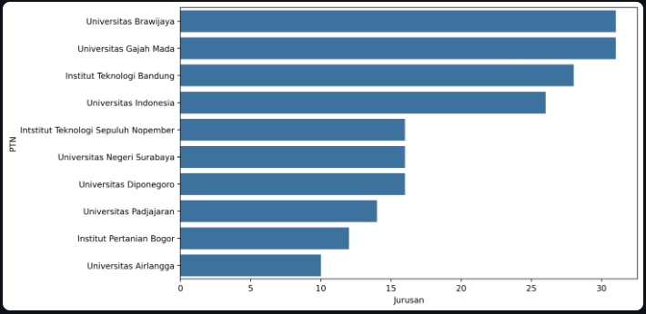
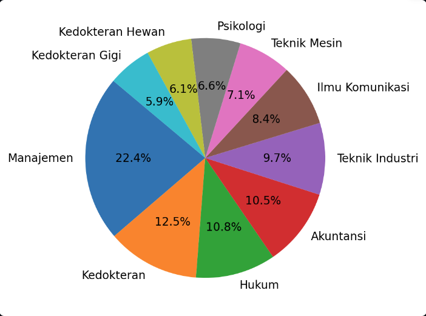
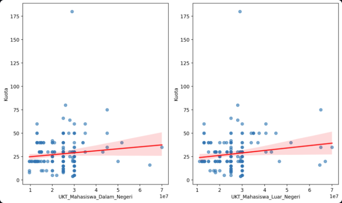
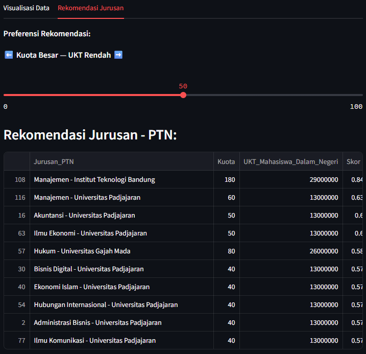

# Analisis & Rekomendasi International Undergraduate Program (IUP) PTN Indonesia
**Final Project VINIX7 (MSIB Mandiri) - Kelompok 10 B**

## Ringkasan Proyek
Proyek ini mengembangkan dashboard interaktif menggunakan **Streamlit** untuk memetakan dan menganalisis sebaran program **International Undergraduate Program (IUP)** pada berbagai Perguruan Tinggi Negeri (PTN) di Indonesia. Dashboard ini dirancang untuk memberikan transparansi data terkait kuota dan biaya kuliah (UKT), serta membantu calon mahasiswa menemukan jurusan yang sesuai melalui sistem rekomendasi berbasis bobot.

## Dataset

- **Data:** `miniteam_b_10.xlsx`
- **Konten:** Daftar PTN, Nama Jurusan, Kuota Penerimaan, UKT Mahasiswa Dalam Negeri, dan UKT Mahasiswa Luar Negeri.

## Visualisasi Data

### 1. Program IUP Terbanyak


*Gambar: Visualisasi 10 PTN dengan jumlah jurusan program internasional terbanyak.*

Universitas dengan jurusan IUP terbanyak adalah **Universitas Brawijaya** dan **Universitas Gajah Mada** dengan total **30 jurusan IUP**.

### 2. Proporsi Kuota Jurusan


*Gambar: Proporsi 10 kuota jurusan terbesar.*

Jurusan **Manajemen** memiliki proporsi kuota terbesar yaitu **22.4% (440)** dari kuota keseluruhan.

### 3. Analisis Korelasi Kuota vs Biaya UKT


*Gambar: Regression Plot menunjukkan hubungan antara jumlah kuota dengan biaya UKT.*

Berdasarkan analisis visual, ditemukan bahwa **banyaknya kuota dan besarnya biaya UKT tidak memiliki korelasi signifikan**. Hal ini menunjukkan bahwa kapasitas daya tampung tidak menjadi penentu utama dalam penetapan biaya pendidikan program internasional.

### 4. Sistem Rekomendasi Jurusan


*Gambar: Fitur rekomendasi jurusan berbasis slider preferensi (Kuota Besar vs UKT Rendah).*

Sistem rekomendasi ini dibangun bukan untuk menunjukkan tren linier antara Kuota dan UKT, melainkan sebagai alat bantu pengambilan keputusan (Decision Support Tool) untuk membantu pengguna menavigasi variabel-variabel yang tidak berkorelasi guna menemukan jurusan yang paling sesuai dengan profil ekonomi dan target peluang mereka.

## Toolkit & Teknologi

- **Python (Pandas):** Proses manipulasi data.
- **Streamlit:** Framework antarmuka dashboard dan hosting.
- **Matplotlib & Seaborn:** Visualisasi data.
- **Scikit-learn (MinMaxScaler):** Normalisasi data untuk sistem rekomendasi.
- **Visual Studio Code:** Code editor.

## Alur Kerja Aplikasi

1. **Data Acquisition:**
   - Data IUP PTN didapat secara manual mencari ke situs-situs web Perguruan Tinggi dan dirangkum ke dalam file Excel.
   - Memuat dataset dari file Excel menggunakan `pandas`.

2. **Data Processing & Scoring:**
   - **Feature Scaling:** Menggunakan `MinMaxScaler` dari `scikit-learn` untuk menormalisasi nilai **Kuota** dan **UKT** ke rentang 0-1 agar dapat dibandingkan secara adil.
   - **Inversion Logic:** Membalik nilai UKT yang telah dinormalisasi (`1 - UKT_norm`), sehingga nilai UKT yang rendah justru memberikan skor yang lebih tinggi bagi pengguna.
   - **Weighted Scoring:** Menghitung skor akhir berdasarkan bobot dari *slider* preferensi pengguna untuk menentukan peringkat jurusan terbaik.

3. **Interface Delivery:**
   - Menyajikan data dalam dua bagian utama:
     - **Tab 1:** Eksplorasi data mentah dan visualisasi distribusi statistik.
     - **Tab 2:** Antarmuka interaktif untuk sistem rekomendasi jurusan.

## Kontributor

- Ida Ayu Made Putri Santiani
- Ida Ayu Putri Widiasuari
- Ida Ayu Tri Sabina Putri
- Ida Bagus Gede Basudewa Weda

## Struktur Repositori
```text
.
├── images/                   # Folder dokumentasi gambar dashboard
│   └── visualization/
├── app.py                    # Script utama aplikasi Streamlit
├── miniteam_b_10.xlsx        # Dataset utama dalam format Excel
├── requirements.txt
└── README.md                 # Dokumentasi proyek